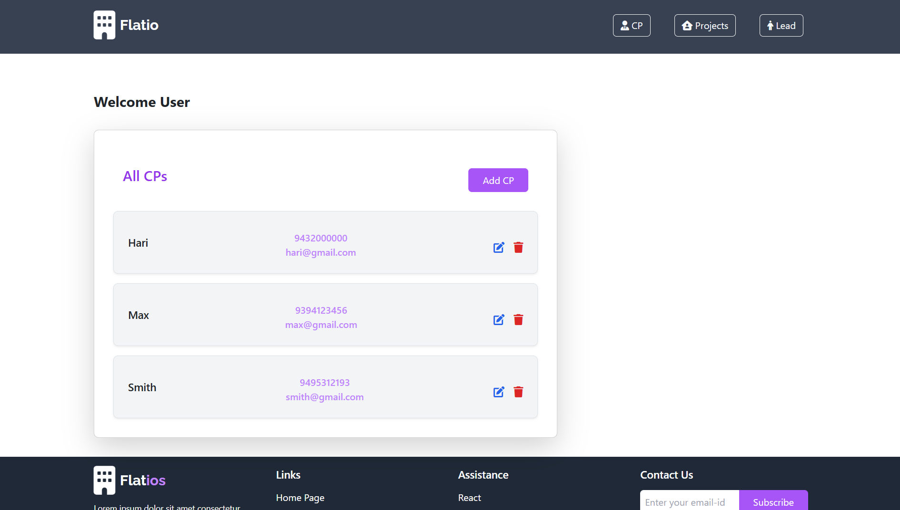

#  Flatio

## Description
This project is built using **React.js** working in Vite and **Node.js** for the backend. It follows the **MVC architecture** and uses **MongoDB** as the database. The project includes CRUD operations and that manage data efficiently.

This **Flat Booking System** allows users to manage and book flats within real estate projects. Admins can create CPs (Channel Partners), assign one or more CPs to a project, and add multiple flats to each project. In the Leads section, users can view available flats for a selected project and book them. Once all flats in a project are booked, the project is marked as complete and removed from the booking list.

## Getting Started

1. **Install dependencies:**

   ```bash
   npm install
2. **Start running:**

   ```bash
   npm run dev

### 🔗 Backend Repository

👉 [Backend GitHub Repo](https://github.com/harikrishnan2193/Flatio_backend)

### 🖼️ Screenshot

